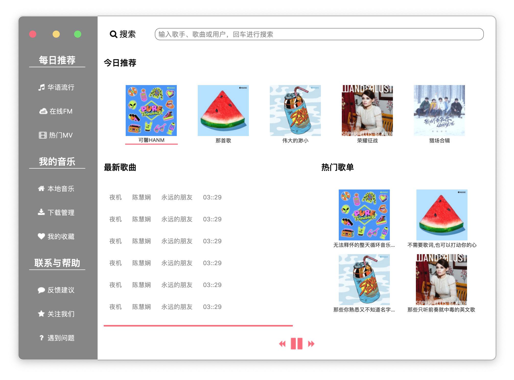
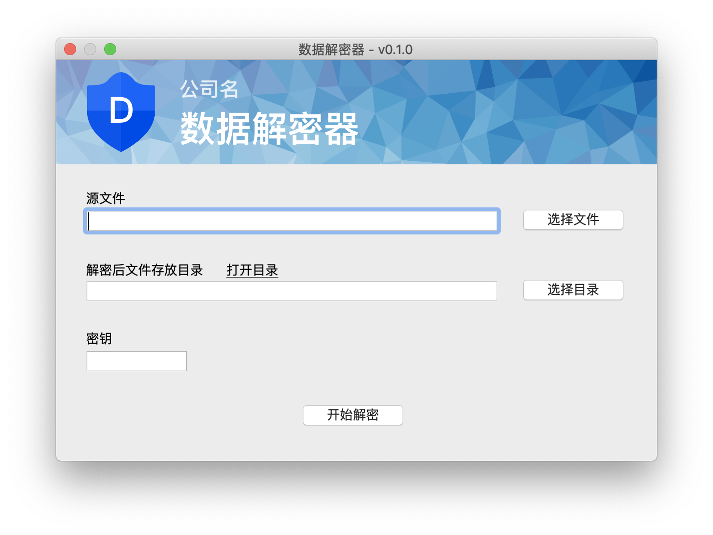

PyQt5 示例
============================

最近需要写一些跨平台的 PC 应用，快速学习了一下 PyQt5。每一个目录都是一个完整的示例，这不是**入门教程**，只是提供示例便于快速熟悉控件的使用。

## 1. 布局器的使用和 UI 美化

主要逻辑[参考](https://zmister.com/archives/477.html)

## 2. 使用 Qt Designer 布局

